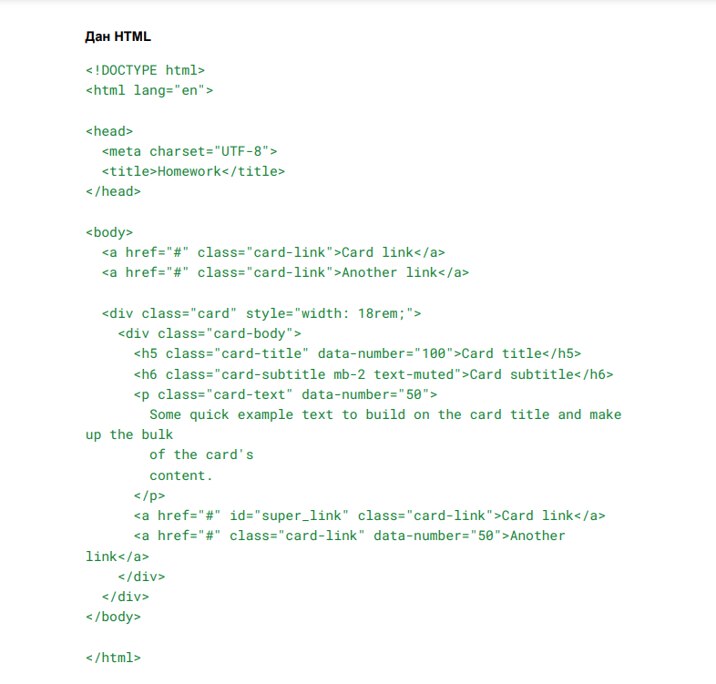

# Продолжение JavaScript #

# Урок 1. Семинар. Введение в DOM (Document Object Model)#

В этом задании вам предстоит работать с элементами на веб-странице, используя
JavaScript.
Вам нужно выполнить несколько действий, связанных с изменением и
извлечением информации из элементов HTML. Ниже приводится список задач.

**Задание 1**

Найдите элемент по id, используя getElementById, элемент с id равным
"super_link" и выведите этот элемент в консоль.

**Задание 2**

Описание задачи:
1. Создайте переменную name и присвойте ей свое имя.
2. Создайте переменную admin и присвойте ей значение из переменной name.
3. Выведите значение переменной admin в консоль.

# #

# Урок 2. Семинар. Основы JavaScript #

**Задание 1**

Описание задачи:
1. Создайте переменные num1 и num2, значения которых пользователь вводит с клавиатуры.
2. Проверьте, что переменная  num1 меньше или равна 1, а переменная num2 больше или равна 3.

**Задание 2**

Описание задачи:

Перепишите следующий код с использованием тернарного
оператора:
#
let test = true;

if (test === true) {

console.log('+++');

} else {

console.log('---');

} 
#

**Задание 3**

Описание задачи:

В переменной day хранится число от 1 до 31. Определите, в какую декаду месяца попадает это число (первая, вторая или третья декада).

**Задание 4 (Необязательное)**

Описание задачи:

1. Получите от пользователя число.
2. Выведите разряды числа: количество сотен, десятков и единиц.

# #

# Урок 3. Семинар. Знакомство с функциями в JavaScript. #

**Задание 1**

Описание задачи:

Создайте функцию, которая возводит переданное число в куб.
Необходимо использовать эту функцию для вычисления и вывода в консоль
результата 2*(3) + 3*(3)

**Задание 2**

Описание задачи:

1. Пользователь вводит с клавиатуры число. Если введён текст, необходимо
вывести сообщение о неверном значении.
2. Создайте функцию, которая вычисляет 13% от данного числа и выводит в
консоль текст:
"Размер заработной платы за вычетом налогов равен “значение”".

**Задание 3**

Описание задачи: 

1. Пользователь вводит с клавиатуры 3 числа. 
2. Создайте функцию, которая определяет максимальное значение среди этих чисел.

**Задание 4**

Описание задачи:

Реализуйте четыре функции, каждая из которых выполняет одну из
следующих операций с двумя числами:
1. Сложение
2. Вычитание
3. Умножение
4. Деление

Функции должны возвращать результат операции.

# #

# Урок 8. Семинар. Циклы и массивы. #

**Задание 1**

Описание задачи:

 Используя цикл for, выведите в консоль 11 строк, где 
 каждая строка содержит индекс и описание числа (0 - это ноль, 1 - нечетное число, 2 - четное
число и т.д.).

**Задание 2**

Описание задачи: Имеется массив [1, 2, 3, 4, 5, 6, 7]. 

Необходимо удалить элементы 4 и 5, чтобы получить массив [1, 2, 3, 6, 7].

**Задание 3**

Описание задачи:

1. Сгенерируйте массив из 5 случайных цифр от 0 до 9.
2. Рассчитайте сумму элементов массива.
3. Найдите минимальное число в массиве.
4. Определите, есть ли в массиве число 3.

**Задание 4**

Описание задачи:

Используя цикл for, выведите в консоль "горку" из символов x с 20
рядами.

